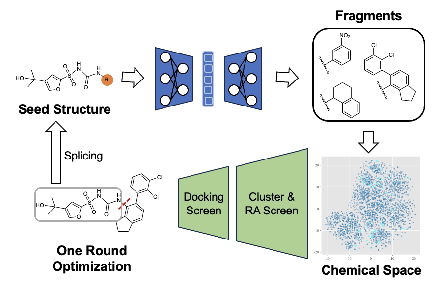

# Coarse-to-Fine: a Hierarchical Diffusion Model for Molecule Generation in 3D


[](https://github.com/qiangbo1222/HierDiff/blob/main/LICENSE)

The official implementation of the algorithm used in 'A molecule generation-oriented lead compound optimization architecture: discovery of potent, selective, oral NLRP3 inflammasome inhibitors' (under review). 
This is our first public release version, so feel free to open an issue if you meet trouble applying our code.




## Environments

### Install via Conda

```bash
# Clone the environment
conda env create -f environment.yaml
#install rascorer
cd rascorer
git clone https://github.com/reymond-group/RAscore.git
pip install --editable .
# Activate the environment
conda activate deepoptc
```

## Molecule Generation
We provide the checkpoint within the `ckpt` folder, download first to run the generation code.

To run the generation, first write the spliting smiles as the following form, `test.smi`
```bash
O=C([*])NC1=C2CCCC2=CC=C1C3=C(Cl)C(Cl)=CC=C3  O=S(C1=CC(C(O)(C)C)=CS1)(N*)=O  O=S(C1=CC(C(C)(O)C)=CS1)(NC(NC2=C(CCC3)C3=CC=C2C4=C(Cl)C(Cl)=CC=C4)=O)=O
```
Then modify the configuration file `examples/decorate_scaffolds.json` to include the input file and output file.

Generate attachment fragments by running:
```bash
python input.py examples/decorate_scaffolds.json
```

## Cluster and Score
To cluster the generated fragments and score them according to Synthesizability, run the following:
```bash
python cluster_score/clustering.py output.csv RA_path output.sdf
```


This Code is build upon [Lib-INVENT](https://github.com/MolecularAI/Lib-INVENT/tree/main) and [RAscore](https://github.com/reymond-group/RAscore/tree/master). We would like to acknowledge their contribution.